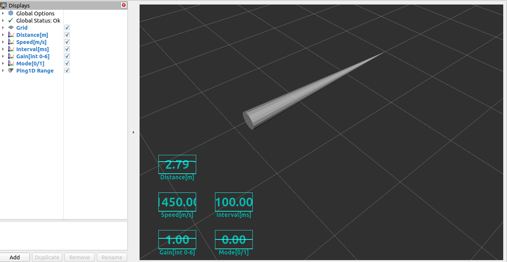

# ping1d_sonar

[](https://github.com/tasada038/ping1d_sonar/stargazers/)
[](https://github.com/tasada038/ping1d_sonar/network/)
[](https://github.com/tasada038/ping1d_sonar/issues/)
[](https://github.com/tasada038/ping1d_sonar/blob/master/LICENSE)

## Overview

ROS 2 package for Blue Robotics Ping Sonar Altimeter and Echosounder

**Keywords:** ROS 2, ping sonar

### License

The source code is released under a [MIT license](LICENSE).

## Requirements

[Ping Sonar Altimeter and Echosounder](https://bluerobotics.com/store/sensors-sonars-cameras/sonar/ping-sonar-r2-rp/)

## Installation

Clone with `--recursive` in order to get the necessary `ping-python` library:

```bash
cd dev_ws/src
git clone -b master --recursive https://github.com/tasada038/ping1d_sonar.git
cd ~/dev_ws/src/ping1d_sonar/ping1d_sonar/ping-python && python3 setup.py install --user
cd ~/dev_ws
colcon build --packages-select ping1d_sonar
```

## Run

Publish sonar data:
```bash
source install/setup.bash
ros2 run ping1d_sonar ping1d_node
```

Publish sonar data using RViz2:
```bash
source install/setup.bash
ros2 launch ping1d_sonar ping_sonar.launch.py
```



## Topics

All topics use `BEST_EFFORT` QoS reliability policy for sensor data consistency.

### Published Topics

| Topic | Type | Description |
|-------|------|-------------|
| `/sensor/sonar/ping1d/range` | sensor_msgs/Range | Range measurement with header |
| `/sensor/sonar/ping1d/data` | std_msgs/Float32 | Distance measurement (meters) |
| `/sensor/sonar/ping1d/param/gain` | std_msgs/Float32 | Current gain setting |
| `/sensor/sonar/ping1d/param/interval` | std_msgs/Float32 | Ping interval (ms) |
| `/sensor/sonar/ping1d/param/mode` | std_msgs/Float32 | Auto mode setting |
| `/sensor/sonar/ping1d/param/speed` | std_msgs/Float32 | Speed of sound (mm/s) |
| `/sensor/sonar/ping1d/param/confidence` | std_msgs/Float32 | Measurement confidence |
| `/sensor/sonar/ping1d/param/pulse_duration` | std_msgs/Float32 | Transmit pulse duration |

### QoS Profile

- **Reliability**: BEST_EFFORT
- **History**: KEEP_LAST
- **Depth**: 5

## Parameters

| Parameter | Type | Range | Default | Description |
|-----------|------|-------|---------|-------------|
| `gain_num` | int | 0-6 | 1 | Sonar gain setting |
| `interval_num` | int | 50-200 | 100 | Ping interval (ms) |
| `mode_auto` | int | 0-1 | 1 | Auto mode (0=manual, 1=auto) |
| `scan_length` | int | 2000-10000 | 2000 | Scan length (mm) |
| `scan_start` | int | 30-200 | 100 | Scan start distance (mm) |
| `speed` | int | 1050000-1550000 | 1450000 | Speed of sound (mm/s) |
| `frame_id` | string | - | ping1d_link | TF frame ID for range messages |

## License

This package is licensed under the MIT License. Originally created by [Blue Robotics](https://github.com/bluerobotics), and maintained by Takumi Asada.

Projects in .gitmodules files are covered by Blue Robotics Inc's MIT License.
